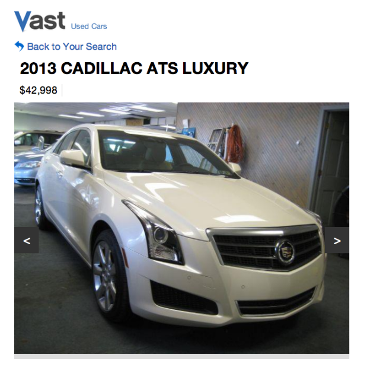
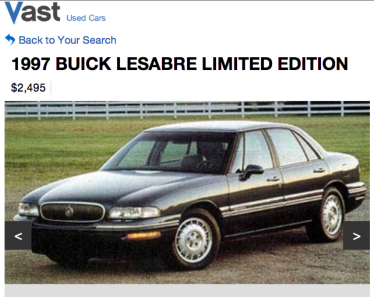
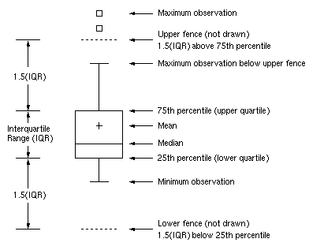

---
jupyter:
  jupytext:
    text_representation:
      extension: .Rmd
      format_name: rmarkdown
      format_version: '1.2'
      jupytext_version: 1.19.1
  kernelspec:
    display_name: Python 3 (ipykernel)
    language: python
    name: python3
---

```{r setup, include=FALSE}
library(reticulate)
use_python("/Users/Zhuanz/anaconda3/bin/python3.11", required = TRUE)
# or use your conda environment
use_condaenv("base", required = TRUE)
```

<!-- #region -->

Outliers, simply put, are data points that are very far from the rest of the data points. They will greatly affect the subsequent analysis results, and even produce misleading analysis results.

Vast provides data to publishers, markets and search engines in three industries, including automobiles, real estate and leisure, accommodation and tourism. Vast's system is integrated through white labelling and in some very popular consumer applications (Southwest GetAway Finder, AOL Travel, Yahoo! Travel, Car and Driver, etc.) provides search results, product suggestions and special offers.

Vast's car data is provided by thousands of second-hand car sellers and published to the market. Because these data are manually entered by users, they are easily affected by human errors, such as users submitting values in the wrong fields, or inadvertent errors or fat finger values. For an 8-year-old vehicle, the odometer reading is 100,000 miles. Intuition tells us that &#36;$100,000 is an unusual price for most small cars. One listing of $42,000 is reasonable, such as the 2013 Cadillac ATS Deluxe Edition, while for another (such as the 1997 Beckles Bree), this may be unexpected.





Detecting outly values is conducive to correcting errors and providing users with excellent and suitable products.

### 1. Data set description
The data set includes the training data set and the test data set:
- `accord_sedan_testing.csv`
- `accord_sedan_training.csv`


The test data set `accord_sedan_training.csv` contains an information list of 417 Honda Accord cars. The characteristics are as follows:

| Characteristic Name | Implication | Type | Example of Taking Values |
|:---:|:---:|:---:|:---:|
| *price* | Price | int | 14995 |
| *mileage* | The number of miles travelled | int | 67697 |
| *year* | Year of listing | int | 2006 |
| *trim* | Grade | str | ex;：High-end model with leather interior <br> ex：High-end model <br> lx：Low-cost model |
| *engine* | Number of engine cylinders | int | 4 Cyl：4Tank <br> 6 Cyl：6Tank |
| *transmission* | Gear shifting method | str | Manual：Manual transmission <br> Automatic：Automatic transmission |


### 2. Import data sets and segment them
<!-- #endregion -->

```{python}
import pandas as pd # Read the data table and perform operations based on the DataFrame structure
import numpy as np
import seaborn as sns
from matplotlib import pyplot as plt
from sklearn import preprocessing
from sklearn.feature_extraction import DictVectorizer
from sklearn.linear_model import LinearRegression
# %matplotlib inline

import warnings
warnings.filterwarnings('ignore') # Warning message is not displayed.
pd.options.display.width = 900 # Dataframe display width setting
```

Colour scheme for drawing
- Green #5dbe80
- Blue #2d9ed8
- Purple #a290c4
- Orange #efab40
- Red #EE5150

```{python}
train = pd.read_csv('accord_sedan_training.csv')
print ('The shape is',train.shape)
train.head(7)
```

```{python}
# Divide train into x and y
train_x = train.drop('price',axis=1)
train_y = train['price']
```

### 3. Feature extraction and construction of linear regression model
Use the `DictVectorizer` in `sklearn.feature_extraction` to realise One-Hot encoding of nominal variables to obtain a 10-dimensional vector space, including:

- engine=4 Cyl
- engine=6 Cyl
- mileage
- price
- transmission=Automatic
- transmission=Manual
- trim=ex
- trim=exl
- trim=lx
- year

Note: The price feature needs to be used when detecting abnormal values.

```{python}
# One-Hot Coding Method I: Use `DictVectoriser` to realise
dv = DictVectorizer()
dv.fit(train.T.to_dict().values()) # one-hot code
print ('Dimension is',len(dv.feature_names_))
dv.feature_names_
```

You can also use `pandas` `get_dummies` function to realise one-hot coding:

```{python}
# One-HotCoding method 2: Use the `get_dummies` function of `pandas` to realise
nomial_var = ['engine','trim','transmission']
multi_dummies = [] # Store three DataFrame
train_x_dummies = train_x[['mileage','year']]
for col in nomial_var:
    dummies = pd.get_dummies(train_x[col], prefix = col)
    train_x_dummies = pd.concat([train_x_dummies,dummies],axis=1) # Stitch the coding results with the non-coding characteristics horizontally.
train_x_dummies.head()
```

```{python}
# Build a linear regression model
train_x_array = dv.transform(train_x.T.to_dict().values())
# train_x_array = train_x_dummies.values # You can also use the results obtained by get_dummies.

LR = LinearRegression().fit(train_x_array,train_y)
' + '.join([format(LR.intercept_, '0.2f')] 
           + list(map(lambda fc: "(%0.2f %s)" % (fc[1], fc[0]), 
               zip(dv.feature_names_, LR.coef_))))
```

### 4. Out-group value detection
The model obtained by fitting the test set, we can predict the price of the test set, calculate the absolute error of each sample, and derive

```{python}
pred_y = LR.predict(dv.transform(train.T.to_dict().values()))
train_error = abs(pred_y - train_y) # Calculate the absolute error
np.percentile(train_error,[75,90,95,99]) # Calculate the percentimal of absolute error data
```

We can also draw a box diagram of train_error to observe the outly value.


```{python}
sns.boxplot(x = train_error,palette = "Set2")
```

It can be seen that there are some out-of-group values in the test set.

In this case, we set the confidence level to 0.95, that is, we consider train_error exceeding 95% percentitals as an outlier value. Next, we draw the normal value (blue) and the outer value (red) in the two-dimensional space:

```{python}
outlierIndex = train_error >= np.percentile(train_error, 95)
inlierIndex = train_error < np.percentile(train_error, 95)

# Get the largest index value of train_error, that is, the extreme outly value.
most_severe = train_error[outlierIndex].idxmax() 

fig = plt.figure(figsize=(7,7))
indexes = [inlierIndex, outlierIndex, most_severe]
color = ['#2d9ed8','#EE5150','#a290c4']
label = ['normal points', 'outliers', 'extreme outliers']
for i,c,l in zip(indexes,color,label):
    plt.scatter(train['mileage'][i], 
                train_y[i], 
                c=c,
                marker='^',
                label=l)
plt.legend(loc = 'upper right',
           frameon=True,
           edgecolor='k',
           framealpha=1,
           fontsize = 12)
plt.xlabel('$mileage$')
plt.ylabel('$price$')
plt.grid('on')
sns.set_style('dark')
```

Let's take a look at the number of outlie values

```{python}
outlierIndex.value_counts()
```

The results of the above figure are also in line with our experience. The higher the mileage of a used car, the lower the price it sells, so for the points in the upper right and lower left areas, there may be some out-of-group values (for the same car). For example, the point in the lower left area, some vehicles with low mileage and low price, may be an accident vehicle or damaged, and the out-of-group value in the upper right area may be the real out-of-group value, which is relatively not easy to have a reasonable explanation, which may be caused by input errors or fat finger input.

There are only more than 400 data in this case. If there is more data, the test results will be more reliable.

### 5.The impact of standardisation on the detection of outlie values
Usually, in order to avoid the influence of different scales. We need to standardise each feature before fitting the linear regression model. Common standardisations include z-score standardisation, 0-1 standardisation, etc. Here we choose z-score standardisation to observe the impact of standardisation on the detection of outly values.

```{python}
# Standardise the features using the `preprocessing.scale` function
columns = train_x_dummies.columns
train_x_zscore = pd.DataFrame(preprocessing.scale(train_x_dummies),columns = columns)
#train_y_zscore = pd.DataFrame(preprocessing.scale(pd.DataFrame(train_y,columns=['price'])),columns = ['price'])

# Linear model fitting
LR_zscore = LinearRegression().fit(train_x_zscore.values,train_y)
' + '.join([format(LR_zscore.intercept_, '0.2f')] 
           + list(map(lambda x: "(%0.2f %s)" % (x[1], x[0]), 
                 zip(dv.feature_names_, LR_zscore.coef_))))
```

```{python}
pred_y_zscore = LR_zscore.predict(train_x_zscore)
train_error_zscore = abs(pred_y_zscore - train_y) # Calculate the absolute error
np.percentile(train_error_zscore,[75,90,95,99]) # Calculate the percentimal of absolute error data
```

```{python}
outlierIndex_zscore = train_error_zscore >= np.percentile(train_error_zscore, 95)
inlierIndex_zscore = train_error_zscore < np.percentile(train_error_zscore, 95)
diff = (outlierIndex_zscore != outlierIndex)  # diff is used to store different indexes of outly value detection results before and after standardisation
diff.value_counts()
```

```{python}
# Draw the test difference points before and after standardisation
fig = plt.figure(figsize=(7,7))

# rep_inlierIndex is an index with normal values before and after standardisation.
rep_inlierIndex = (inlierIndex == inlierIndex_zscore)

indexes = [rep_inlierIndex, outlierIndex, outlierIndex_zscore]
color = ['#2d9ed8','#EE5150','#a290c4']
markers = ['^','<','>']
label = ['inliers', 'outliers before z-score', 'outliers after z-score']
for i,c,m,l in zip(indexes,color,markers,label):
    plt.scatter(train['mileage'][i], 
                train_y[i], 
                c=c,
                marker=m,
                label=l)
plt.xlabel('$mileage$')
plt.ylabel('$price$')
plt.grid('on')
plt.legend(loc = 'upper right',
           frameon=True,
           edgecolor='k',
           framealpha=1,
           fontsize = 12)
sns.set_style('dark')
```

It can be seen from the results that the test results of the vast majority of samples are consistent. There are two samples that differ. One sample will be detected as an out-of-the-group value before standardisation, and the other sample will be detected as an out-of-group value after standardisation. Although there is not much difference in the detection effect before and after standardisation in this case, we still recommend that the features be standardised before linear modelling.

### 6.Verification of the test set
Let's first draw all the sample points of the training set and the test set with mileage as the horizontal coordinate and price as the vertical coordinate.

```{python}
test = pd.read_csv('accord_sedan_testing.csv')

datasets = [train,test]
color = ['#2d9ed8','#EE5150']
label = ['training set', 'testing set']
fig = plt.figure(figsize=(7,7))
for i,c,l in zip(range(len(datasets)),color,label):
    plt.scatter(datasets[i]['mileage'], 
                datasets[i]['price'], 
                c=c,
                marker='^',
                label=l)
plt.xlabel('$mileage$')
plt.ylabel('$price$')
plt.grid('on')
plt.legend(loc = 'upper right',
           frameon=True,
           edgecolor='k',
           framealpha=1,
           fontsize = 12)
sns.set_style('dark')
```

Let's take a look at the generalisation effect of the model trained on the training set on the test set:

```{python}
pred_y_test = LR.predict(dv.transform(test.T.to_dict().values()))
test_error = abs(pred_y_test - test['price'])

# Use the distribution diagram to observe the error of the test set
fig = plt.figure(figsize=(7,7))
sns.distplot(test_error,kde=False)
plt.xlabel('$test\_error$')
plt.ylabel('$count$')
plt.grid('on')
```

```{python}
# Find out the extreme out-group value
most_severe_test = test_error.idxmax()
test.iloc[most_severe_test]
```

It can be seen from the distribution diagram that our model has very poor prediction performance for one of the samples on the test set. This sample is an extremely out-of-group sample. The car is a 6-cylinder high-configution version, and its mileage is only about ~60,000 miles, but its selling price is only $2612.

Based on experience, we speculate that there are two possibilities for this out-of-group sample:

1.There is an error when filling in the website;

2.The vehicle has damage to the body or car ownership problems (stolen or robbed)

### 7.Use LOF for outly value detection in the test set

```{python}
test = pd.read_csv('accord_sedan_testing.csv')
fig = plt.figure(figsize=(7,7))
plt.scatter(test['mileage'], 
            test['price'], 
            c='#EE5150',
            marker='^',
            label='testing set')
plt.xlabel('$mileage$')
plt.ylabel('$price$')
plt.grid('on')
plt.legend(loc = 'upper right',
           frameon=True,
           edgecolor='k',
           framealpha=1,
           fontsize = 12)
sns.set_style('dark')
```

### The formula for calculating the density
$$
lrd_k(x) = \left( \frac{1}{k} \sum_{y \in N_k(x)} rd_k(x, y) \right)^{-1}
$$

Among them, $rd_k(x, y)$ sample point $x$ to sample point $y$ $k$th can reach the distance

### LOF factor calculation formula

$$
lof_k(x) = \frac{1}{k} \sum_{y \in N_k(x)} \frac{lrd_k(y)}{lrd_k(x)}
$$

The general process of LOF algorithm can be described as:

1.Initialise k and use it to calculate the kth distance later;

2.Calculate the distance between each sample point and other points and sort them;

3.Calculate the kth distance and the kth domain of each sample point;

4.Calculate the reach density and LOF value of each sample point;

5.Sort the LOF values of all sample points and compare them with 1. The larger than 1, the more likely it is to be an outly value.

```{python}
data = test[['mileage','price']]
```

```{python}
# Import sklearn to calculate the data related to the nearest neighbour. The nearest neighbour
from sklearn.neighbors import NearestNeighbors
import numpy as np

# Define the function to calculate the distance that can be reached by the kth
def k_Distance(data, k):
    neigh = NearestNeighbors(n_neighbors=k)
    model = neigh.fit(data)
    
    nums = data.shape[0]

    k_distance = []
    neighbor_info = []
    
    for index in range(nums):
        
        # K distances
        dist = neigh.kneighbors([data[index]], n_neighbors = k + 1)
        # The biggest dist
        k_distance.append(dist[0][-1][-1])
        
        # `neighbour` is an index of the k nearest neighbours, and `dists` is the corresponding distances
        dists, neighbor = neigh.radius_neighbors([data[index]], radius = k_distance[index])
        
        # Exclude oneself
        mask = neighbor[0] != index     
        neighbor_info.append([neighbor[0][mask], dists[0][mask]])
    return k_distance, neighbor_info
```

```{python}
# Define the function to calculate the local reachable density
def reach_density(data, k_distance, neighbor_info):
    
    nums = data.shape[0]
    density_list = []
    
    for index in range(nums):
        
        neighbors, dists = neighbor_info[index]
        nums_neigh = len(neighbors)
    
        sum_dist = 0
        
        for item in range(nums_neigh):
            
            k_dist_o = k_distance[neighbors[item]] 
    
            direct_dist = dists[item]
        
            reach_dist_p_o = max(k_dist_o, direct_dist)
        
            sum_dist += reach_dist_p_o
           
        density_list.append(nums_neigh/sum_dist)
    
    return density_list

# Define the function to calculate the LOF factor
def cal_lof(index, data, neighbor_info, lrd_list):
    
    point_p = data[index]
    neighbors, _ = neighbor_info[index]
    
    nums_neigh = len(neighbors)
    sum_density = 0
    
    for item in range(nums_neigh):
        
        sum_density += lrd_list[item]

    return sum_density/(nums_neigh*lrd_list[index])
```

```{python}
dists, neighbor_info = k_Distance(data.values, 2)

lrd_list = reach_density(data, dists, neighbor_info)

nums = data.shape[0]

lof_list = []

for index in range(nums):
    
    lof = cal_lof(index, data.values, neighbor_info, lrd_list)
    lof_list.append(lof)

boolean_array = [item > 5 for item in lof_list]

indicy = []
for key, value in enumerate(boolean_array):
    if value:
        indicy.append(key)

print (indicy)
```

Draw the out-group value:

```{python}
fig = plt.figure(figsize=(7,7))
for i in data.index:
    if i not in indicy:
        plt.scatter(data.iloc[i]['mileage'], 
                data.iloc[i]['price'], 
                c='#2d9ed8',
                s=50,
                marker='^',
                label='inliers')
    else:
        plt.scatter(data.iloc[i]['mileage'], 
                data.iloc[i]['price'], 
                c='#EE5150',
                s=50,
                marker='^',
                label='outliers')
        plt.xlabel('$mileage$')
        plt.ylabel('$price$')
        plt.grid('on')
```

#### Another more chaotic way of writing

```{python}
test_2d = test[['mileage','price']]
from sklearn.neighbors import NearestNeighbors
import numpy as np

neigh = NearestNeighbors(n_neighbors=5)   # The default is European distance.     
model = neigh.fit(test_2d)

data = test_2d
# Dist is the distance between each sample point and the point in the kth distance neighbourhood (including itself), and neighbourhood is the number of the kth distance neighbourhood point (including itself)
dist, neighbor = neigh.kneighbors(test_2d, n_neighbors=6)

k_distance_p = np.max(dist, axis=1)

nums = data.shape[0]
lrdk_p = []
lof = []

for p_index in range(nums):                    
    rdk_po = []
    neighbor_p = neighbor[p_index][neighbor[p_index] != p_index]
    for o_index in neighbor_p:
        rdk_po.append(max(k_distance_p[o_index], int(dist[p_index][neighbor[p_index] == o_index])))
    lrdk_p.append(float(len(neighbor_p)) / sum(rdk_po))

for p_index in range(nums):                    
    lrdk_o = []
    neighbor_p = neighbor[p_index][neighbor[p_index] != p_index]
    for o_index in neighbor_p:
        lrdk_o.append(lrdk_p[o_index])
    lof.append(float(sum(lrdk_o)) / (len(neighbor_p) * (lrdk_p[p_index])))

fig = plt.figure(figsize=(7, 7))

for index, size in zip(range(nums), lof):     
    if index in indicy:
        plt.scatter(data['mileage'].iloc[index],        
                    data['price'].iloc[index],
                    s=np.exp(lof[index]) * 50,
                    c='#efab40',
                    alpha=0.6,
                    marker='o')
        plt.text(data['mileage'].iloc[index] - np.exp(lof[index]) * 50,
                 data['price'].iloc[index] - np.exp(lof[index]) * 50,
                 str(round(lof[index], 2)))
    else:
        plt.scatter(data['mileage'].iloc[index],        
                    data['price'].iloc[index],
                    s=np.exp(lof[index]) * 50,
                    c='#5dbe80',
                    alpha=0.6,
                    marker='o')
        plt.text(data['mileage'].iloc[index] - np.exp(lof[index]) * 50,
                 data['price'].iloc[index] - np.exp(lof[index]) * 50,
                 str(round(lof[index], 2)),
                 fontsize=7)

plt.xlabel('mileage')
plt.ylabel('price')
plt.grid(False)                                
plt.show()
```

