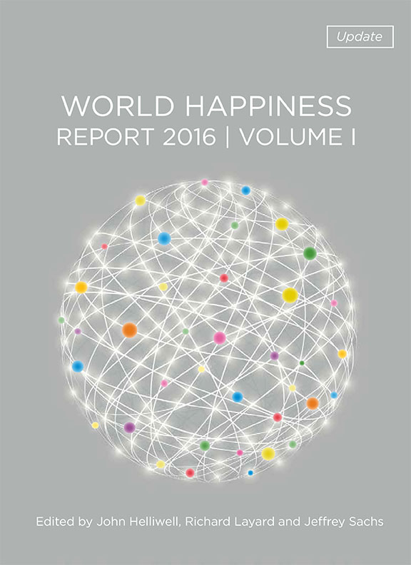
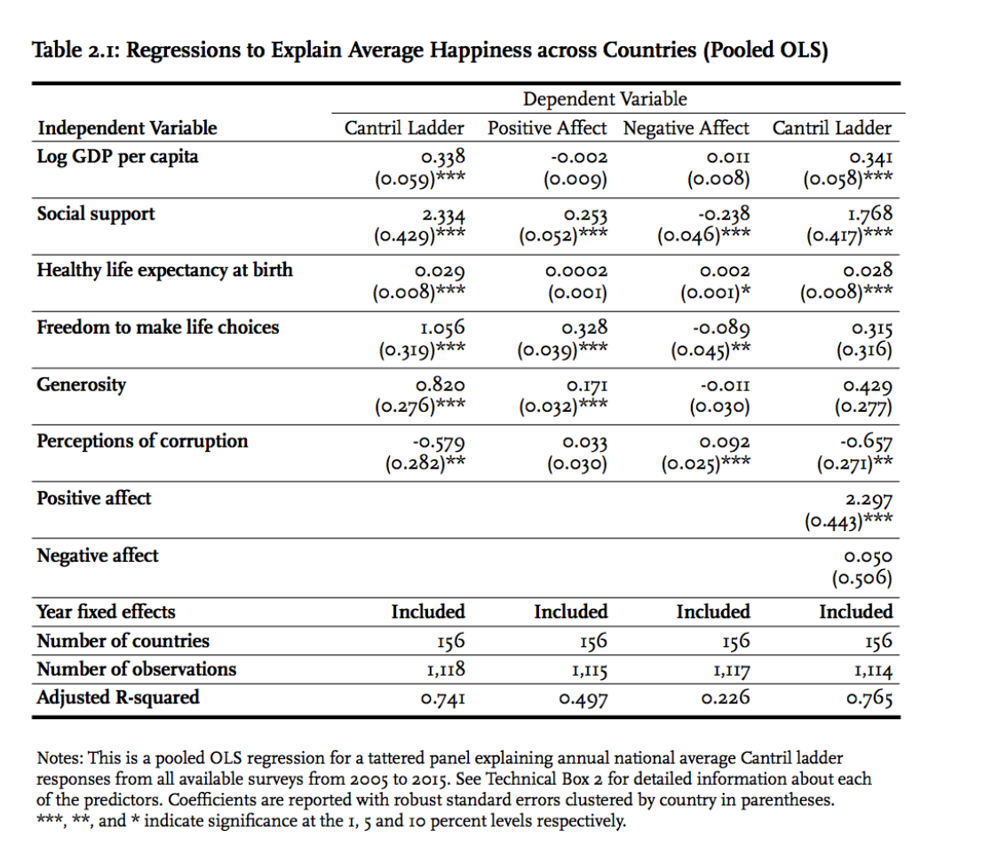
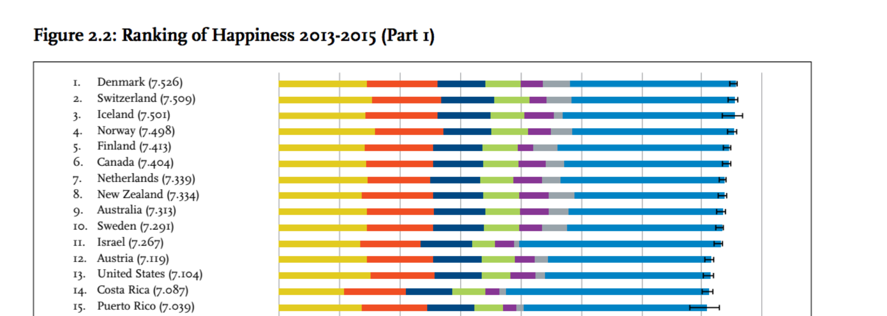
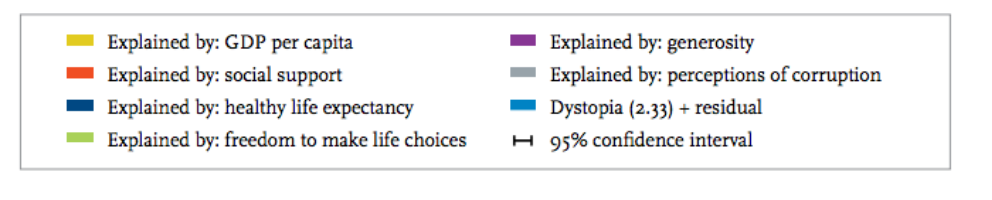
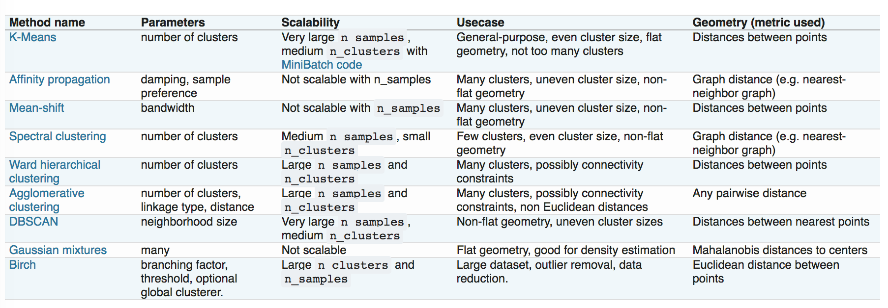

---
jupyter:
  jupytext:
    text_representation:
      extension: .Rmd
      format_name: rmarkdown
      format_version: '1.2'
      jupytext_version: 1.19.1
  kernelspec:
    display_name: Python 3 (ipykernel)
    language: python
    name: python3
---

```{r setup, include=FALSE}
library(reticulate)
use_python("/Users/Zhuanz/anaconda3/bin/python3.11", required = TRUE)
# or use your conda environment
use_condaenv("base", required = TRUE)
```

<!-- #region -->

The World Happiness Report is a landmark survey report (official website) on the happiness status of countries around the world. The World Happiness Report of 2017 was released at the United Nations General Assembly on March 20, 2017. That day is also International Day of Happiness. As governments, organisations and civil society increasingly use the World Happiness Report to guide their policy trends and reflect the effectiveness of their policies, the World Happiness Report has gained global recognition. Interestingly, in the 2017 World Happiness Report, the analysis of happiness in the workplace was added for the first time, and China and Africa were also analysed in depth. Is the United Nations also influenced by China's threat theory? Anyway, it's better not to involve any politics in our case. China's international influence can be seen from this. Top experts in various fields - economics, psychology, investigation and analysis, national statistics, health, public policy, etc. - study how to evaluate the development of a country through these indicators. The report also shows the new "science of happiness" to explain the changes in the degree of happiness of individuals and people.



The first World Happiness Report was released in 2012, the second was published in 2013, and the third was released in 2015. This case uses the 2016 World Happiness Report (data source), which covers 157 countries around the world (193 countries in the world) in 2016 The survey results of various indices.

In This Case, We First Explore The Correlation Of Each Index In The Data Set, And Then We Cluster It Through Various Clustering Methods, And Then We Use A Variety Of Dimensional Methods To Map The Sample (A Country) To The Two-Dimensional Plane, And Visualise It By Specifying The Isomap. We use the labels of the clustering results to render the sample points, compare the effects of different clustering methods, and then explore the relationship between the clustering results and the happiness index ranking Happiness Rank and the region of the region where the country is located.

### 0 Package version information
Check the version of the package by executing the shell command in the notebook.


```{python}
# !pip freeze | grep pandas;
# !pip freeze | grep numpy;
# !pip freeze | grep matplotlib;
# !pip freeze | grep seaborn;
# !pip freeze | grep scikit-learn;
# !pip freeze | grep scipy
```

### 1Description of dataset
Usually, we don't know which packages we need to use until the analysis process, so a common practice is to put all the package transfer operations at the forefront after we complete the whole analysis process, so as to make the file easy to read, and the technical means needed in the whole analysis are clear at a glance. As usual, first import the package that needs to be used after importing.

```{python}
import pandas as pd
import numpy as np
import matplotlib.pyplot as plt
import seaborn as sns
import scipy.cluster.hierarchy as sch # Hierarchical clustering
from scipy.spatial.distance import pdist, squareform # pair-wise distance sample distance calculation, pdist returns vector form, squareform returns matrix form
from sklearn import preprocessing, neighbors, cluster, metrics, manifold, decomposition
import warnings
warnings.filterwarnings('ignore') 

np.set_printoptions(precision=5, suppress=True)  # Set the floating point display bits, and try not to use the scientific counting method.
# %matplotlib inline
# %config InlineBackend.figure_format = 'retina' #Adjust the clarity of the picture output in the notebook to make it clearer on the retina screen.
```

Read the 2016_world_happiness.csv file and show the first five samples.

```{python}
wh = pd.read_csv('2016_world_happiness.csv')
print (wh.shape)
wh.head()
```

```{python}
wh.columns
```

The data set contains a total of 13 characteristics. Country and Region represent the name of the country and the region of the country respectively. Happiness Rank and Happiness Score represent the happiness index ranking and the happiness index respectively, which are obtained through the Gallup World Poll. The respondents will be asked a series of questions called Cantril ladder. The respondents' answers are 0-10 different scores, 0 means the worst state and 10 means the best state. The score comes from the national representative sample from 2013-2016, and the Gallup weight is used to estimate the happiness index of each respondent. Lower Confidence Interval and Upper Confidence Interval represent the lower and upper bounds of the confidence interval.

After the above 6 characteristics, the other 6 factors affecting the happiness index are listed: Economy (GDP per Capita) - economic situation (GDP per capita), Family - family situation (indicating social support), Health (Life Expectancy) - health status (life expectancy), Freedom - freedom situation (including personal, financial freedom, etc.), Trust (Government Corruption) - trust in the government (degree of corruption) and Gene Rosity - generous situation. Its specific value represents the contribution of the feature to Happiness Score, which is the product of the fitting coefficient and the value of the variable. The OLS (minimum squares) fitting of Happiness Score for each feature in the 2016 World Happiness Report is shown in the following table. In the following description, "6 key factors" or "key factors" are used to represent these six characteristics.



Dystopia Residual represents dystopian remnants. Dystopia is the opposite of Utopia. It is a fictional country. This country has the most unhappy people in the world, that is, the six key factors affecting the happiness index of this country are the lowest, the lowest income, the shortest life expectancy, the least generous, the most serious corruption, the most Unfreedom and least social support. The purpose of establishing a dystopia is to have a benchmark so that all countries can be better, which is conducive to comparison between countries. The residual is called residual, which is some factors that cannot be explained when using the above six factors to predict the happiness index. It varies from country to country and reflects the residual of using six key factors to predict the Happiness Score. We can use the regression model in the above table to predict the happiness index of Dystopia (the result is 2.33). The following figure shows the average residual when the equation in the above table is applied to each country. Therefore, the value of Dystopia Residual is actually the happiness index of Dystopia (2.33) + the residual of each country.




Therefore, for this data set, we no longer need to build a regression model to predict the happiness index, so from the perspective of clustering, let's see whether the weight of the key factors of each country can divide each country into several categories, and observe the relationship between the cluster results and the location of the country.

### 2 Data explore
In the previous part, we spent a lot of time explaining the characteristics. In this part, we use relevant methods such as correlation analysis and descriptive statistics to explore data. The value of Economy (GDP per Capita) is larger than that of the other five key factors, so the economic situation of a country largely determines the happiness index of a country.

### 2.1 Correlation analysis
Next, let's first draw the relevant matrix of key factors:


```{python}
wh_key = wh.drop(['Country','Region' , 'Happiness Rank','Happiness Score',
                  'Lower Confidence Interval','Upper Confidence Interval', 'Dystopia Residual'],axis=1)
corrmat = wh_key.corr() #Get the correlation matrix
f, ax = plt.subplots(figsize = (8,8))
sns.heatmap(corrmat, square=True)
```

You can also use scatterplot to draw a scatter plot and correlation diagram between the two:

```{python}
sns.pairplot(wh_key, kind='reg', diag_kind='kde', diag_kws=dict(shade=True), size=4) 
```

It can be seen from the two figures above that Family and Economy (GDP per Capita) have a positive correlation (there are other positive or negative correlations). But we need to think carefully about whether this really means that there is a positive correlation between the two? Since the value of the key factor represents the coefficient when predicting the Happiness Score, it can only represent the same weight of the Happiness Score, which does not explain the correlation between the two, so there is no point in doing relevant analysis for this data set. Meaningful, unless you get the value of the original key factor, instead of the weight after fitting.

### 2.2 Differences in happiness index in each region
Let's take a look at how many happiness indexes China and Japan rank in the world?

```{python}
wh.loc[wh['Country']=='China']
```

```{python}
wh.loc[wh['Country']=='Japan']
```

China's happiness index ranking is in the middle, while Japan's happiness index ranking is in the upper-middle level, with a difference of 30 places.

We use the boxplot in seaborn to observe the differences in happiness index between different regions:

```{python}
f, ax = plt.subplots(figsize = (8,8))
ax = sns.swarmplot(y="Region", x="Happiness Score", data=wh)
ax = sns.boxplot(y="Region", x="Happiness Score", data=wh)
```

Judging from the average happiness index, sub-Saharan Africa has the lowest happiness, South Asia ranks second to last, and Western Europe and North America, which are dominated by capitalist countries, have a higher degree of happiness. At the same time, the happiness index of Middle East and Northern Africa is the biggest difference between the Middle East and North Africa. We guess that the region where the Middle East and North Africa are mixed with oil countries and war-turbed countries, the large wealth brought by oil and the division of countries brought about by war led to There is a huge difference in happiness between countries.

### 2.3 Differences in the impact of key factors on the happiness index in different regions
Similar to the method in the previous section, we draw the differences in the impact of different key parameters on the happiness index according to the region. Since the happiness index of each country is different, in order to derive the impact of each key factor on the happiness index of different countries, we should divide the contribution value of each key factor by its happiness index to obtain the proportion of the contribution of key factors.

First of all, divide each line in wh_key by the corresponding Happiness Score value:

```{python}
for row in range(wh.shape[0]):
    wh_key.loc[row] = wh_key.loc[row]/wh['Happiness Score'].loc[row]
```

Then splice the Region column with wh_key through the pd.concat method to get wh_norm:

```{python}
reg_df = pd.DataFrame(wh['Region'],columns=['Region']) # Convert Series to DataFrame
wh_norm = pd.concat([reg_df,wh_key],axis=1) # Splice wh_key with reg_df
```

Next, we use the contribution ratio value to examine the differences in the impact of key factors in different regions on the happiness index.

```{python}
fig, axes = plt.subplots(nrows=6, ncols=1,figsize=(10,30))
for col, ax in zip(wh_key.columns,axes.flatten()):
    sns.swarmplot(x=col, y='Region', data=wh_norm, ax=ax)
    sns.boxplot(x=col, y='Region', data=wh_norm, ax=ax)
```

From the six figures above, we can see that in low-income areas (the income situation cannot be derived from this data set, and the "low income" here is an empirical judgement) such as Sub-Saharan Africa and Southern Asia, the contribution of national GDP to the happiness index is Compared with other regions, the main source of happiness in these areas is the happiness of freedom and generosity. The happiness of high-income areas such as Western Europe and North America comes from economic conditions, family, health status, freedom and other aspects. It seems that they are quite satisfied with other regions in all aspects. Interestingly, Australia and New Zealand Australia and New Zealand have great confidence in the government's decisions, and compared with other regions, they have the greatest sense of happiness from the government's welfare and policies.


### 3 Cluster the samples

We will use the contribution ratio value data wh_norm of key factors to cluster each sample. We will use Kmeans, MiniBatchKMeans, Spectral Clustering and DBSCAN for clustering. The comparison of each clustering method in sklearn is shown in the figure below.



We first cluster in the high-dimensional space (6 dimensions), then map the sample to the two-dimensional space in the next section, and render the colour of the sample with the cluster result label.

First, remove the 'Region' column in the wh_norm data box and convert DataFrame to ndarray:

```{python}
wh_array = wh_norm.drop('Region', axis=1).values 
```

In order to facilitate subsequent drawing, the process of clustering is defined as function clustering:

```{python}
names = ['KMeans', 'MiniBatchKMeans','SpectralClustering','DBSCAN']

# Define the function of clustering
def clustering(n_clusters=5, eps=.04): # DBSCAN has no n_clusters parameter, and the final number of clusters is determined by eps.
    labels = {} # Category labels that store cluster results
    centers = {} # Store data of various centre points
    preds = {} # When the cluster object does not have the labels_ attribute, the prediction result is stored in this dictionary variable.
   
    # Establish instance objects of various cluster model classes
    kmeans = cluster.KMeans(n_clusters=n_clusters)
    minibatch_means = cluster.MiniBatchKMeans(n_clusters=n_clusters)
    spectral = cluster.SpectralClustering(n_clusters=n_clusters,
                                      eigen_solver='arpack', affinity="nearest_neighbors")
    dbscan = cluster.DBSCAN(eps=eps)
    
    algorithms = [kmeans, minibatch_means, spectral, dbscan]
    for name, algorithm in zip(names, algorithms):
        algorithm.fit(wh_array) 
        if hasattr(algorithm, 'labels_'):     # Judge whether the cluster object has the labels_ attribute
            labels[name] = algorithm.labels_.astype(np.int)
        else:
            preds[name] = algorithm.predict(wh_array)
        if hasattr(algorithm, 'cluster_centers_'):
            centers[name] = algorithm.cluster_centers_
    return labels, centers, preds
```

### 4 Hierarchical clustering
In this part, we use the scipy.cluster.hierarrchy hierarchical clustering method for clustering. The hierarchical clustering here is aggregated hierarchical clustering, that is, each sample point is initially regarded as a cluster. Then draw a tree diagram of the cluster results.

### 4.1 Realise hierarchical clustering
First of all, the linkage matrix is obtained through the wh_array data matrix, in which 'ward' means that the distance between classes is calculated using the ward variance minimisation algorithm. You can also try to change the connection algorithm to single, complete or average, etc., and you can also change the distance measurement method metrics from the default European distance euclidean to cityblock, hamming or cosine, etc. For example, it is more appropriate to choose cosine to calculate the distance in text clustering.


```{python}
Z = sch.linkage(wh_array, method='ward', metric='euclidean')
```

### 4.2 Choose the best connection algorithm and distance measurement method
In order to choose the best connection algorithm and distance measurement method, we need to calculate the Cophenetic Correlation Coefficient of the clustering result through the cophenet function, which measures the implicit component of the tree diagram. The actual paired distance information of the original data is preserved to the extent of the distance. The closer its value is to 1, the better the hierarchical cluster maintains the original pair distance information. Therefore, we hope to find the combination closest to 1 (methods, metrics) by exhausting methods and metrics.


```{python}
methods = ['single', 'complete', 'average', 'weighted', 'ward']
metrics = ['braycurtis', 'canberra', 'chebyshev', 'cityblock',
    'correlation', 'cosine', 'dice', 'euclidean', 'hamming',
    'jaccard', 'kulsinski', 'mahalanobis', 'matching',
    'minkowski', 'rogerstanimoto', 'russellrao', 'seuclidean',
    'sokalmichener', 'sokalsneath', 'sqeuclidean']
```

```{python}
c_init = 0
for method in methods:
    for metric in metrics:
        try: # 某些(method,metric)的组合理论上是不可行的，比如在连接方法为'ward'的情况下只能使用`euclidean`
            Z = sch.linkage(wh_array, method=method, metric=metric)
            c, coph_dists = sch.cophenet(Z, pdist(wh_array))
        except:
            pass
        if c > c_init:
            c_init = c
            best_para = (method, metric, c)
print (best_para)
```

Use the optimal parameter combination best_para for hierarchical clustering:

```{python}
Z = sch.linkage(wh_array, method=best_para[0], metric=best_para[1])
```

### 4.3 Explanation of hierarchical clustering process
The linkage function will use the connection method and distance measurement method we specify to calculate the distance between the clusters. The hierarchical clustering process first regards each sample point as a singleton cluster, and in each subsequent iteration, the two closest clusters are combined into a new cluster. Therefore, linkage will return an array of n−1 (n is the number of samples) dimension, providing relevant information about the n−1 merge process when n clusters are merged.

Z[i] shows the relevant information of the ith merger, such as the information of the first merger Z[0]:


```{python}
Z[0]
```

Each row array has the following format: [idx1, idx2, dist, sample_count]. The result returned above indicates that the linkage algorithm combines two sample points with index numbers 5 and 8, and the distance between them is 0. 00784, this merger produces a cluster containing 2 samples.

Let's take a look at the distance between the two obtained by using pdist:

```{python}
n_samples = wh_key.shape[0] # Number of samples
idx1 = 5
idx2 = 8

# The index number of the distance matrix is dist_idx, which is relatively complicated and takes some time to think about it.
dist_idx = np.abs(sum(range(-(n_samples-1),-(n_samples-1)+idx1)))+(idx2-idx1) 
dist = pdist(wh_array)[dist_idx-1]
print (dist)
```

This distance value is the third element of Z[0].

Let's take a look at the process of the first 15 iterations;

```{python}
Z[:15]
```

We found a strange problem. We have 157 samples, and the index starts from 0 to 156. So why does a cluster with index number 157 appear in the 4th iteration? This is because every time we generate a new cluster, the index number will be added 1. The index number of the cluster is different from the index number of our sample. If the index number of the cluster is idx >= len(X), then the cluster is actually a new cluster formed by the Z[idx-len(X)] iterative process.

### 4.4 Dendrogram 
Dendrogram, also known as genealogy diagram or tree diagram, is an excellent way to display the results of hierarchical clustering. From this diagram, you can clearly see the distance between clusters and the order of merger in the hierarchical clustering process.

```{python}
f, ax = plt.subplots(figsize=(20,10))
plt.xlabel('sample index', fontsize=20)
plt.ylabel('distance',fontsize=20)
sch.set_link_color_palette(['g', 'y', 'c', 'k']) # 设置色系
sch.dendrogram(Z, leaf_rotation=90, leaf_font_size=8, color_threshold =0.12)
plt.xticks(fontsize=8)
plt.yticks(fontsize=15)
plt.show()
```

The horizontal coordinates of the tree diagram represent the index number of the sample, and the vertical coordinates represent the distance obtained using the average method.

If we want to check the results of gathering all samples into 10 clusters, we can use truncate_mode='lastp' to specify the display of the last 10 merged clusters, and show_contracted=True can display the number of samples contained in each cluster (so that Include in parentheses), the cluster containing a sample shows the cluster index number.

```{python}
f, ax = plt.subplots(figsize=(20,10))
plt.xlabel('sample index', fontsize=20)
plt.ylabel('distance',fontsize=20)
sch.set_link_color_palette(['g', 'y', 'c', 'k'])
sch.dendrogram(Z, 
               truncate_mode='lastp',
               p=10,
               leaf_rotation=90, 
               leaf_font_size=8, 
               color_threshold =0.125,
               show_contracted=True,)
plt.xticks(fontsize=15)
plt.yticks(fontsize=15)
plt.show()
```

### 4.5 Extract hierarchical clustering results
##### maxclust
Use the fcluster method to extract the cluster results. If we need to specify the number of final clusters as 10, we can specify criterion='maxclust' and make t=10.


```{python}
hierarchy_labels = sch.fcluster(Z, t=10, criterion = 'maxclust')
hierarchy_labels
```

#### distance
We can also divide clusters in combination with the tree diagram, set a maximum distance, and cut the tree diagram with the horizontal line where the maximum distance is located in the tree diagram. It is not difficult to understand that how many vertical lines are cut by this horizontal line will eventually divide all the samples into several clusters. For example, if we set the maximum distance max_distance to 0.15, we can get 5 clusters:

```{python}
sch.fcluster(Z, t=0.15, criterion = 'distance')
```

#### inconsistency
If we can't determine the number of clusters in advance, we can use the default calculation standard inconsistent of fcluster to determine the division of the cluster, that is, through the height distribution of each cluster on the tree diagram when jumping in the vertical direction to merge, to decide which jump will make the two "real" (most In some cases, we can't know the real cluster division) The clusters are merged together by mistake, that is, considering "what makes a distance jump a jump?". For detailed algorithms, please refer to scipy.cluster.hierarch Y. inconsistent.

When using this method, we need to specify the threshold t and depth. If the inconsistency value of the cluster and all its descendants (determined by depth) is less than or equal to the threshold t, then all its descendants belong to the same cluster.

```{python}
sch.fcluster(Z, t=3, depth=10)
```

It can be seen that the results obtained by inconsistency are more consistent with those obtained by maxclust. In the next section, we will use the clustering results hierarchical_labels obtained by the maxclust method for visualisation.

### 4.6 Use the distance matrix to realise clustering
We can combine sns.clustermap and use the distance matrix to make a heat map of clustering.

First, choose the colour system that you think is better for visualisation (colour system adjustment reference colour_palettes). You can preview your colour system block through sns.palplot to adjust the colour system you think is the most comfortable.


```{python}
sns.palplot(sns.diverging_palette(130, 25, n=10))
```

#### Calculate the distance matrix dist_mat to get clustermap
Get the distance vector through pdist(), and then use squareform() to convert it into a matrix:

```{python}
dist_mat = squareform(pdist(wh_array))
```

```{python}
cmap = sns.diverging_palette(130, 25, n=10, as_cmap=True)
sns.clustermap(dist_mat, cmap=cmap)
```

It is easy to see that this cluster result is consistent with the cluster result in 4.4.

#### Get clustermap directly through array
We can also get clustermap directly through array, but above the graphic is the clustering of features. Readers can think about whether the cluster results of the characteristics obtained by this clustermap can be used as a method of feature selection?

```{python}
sns.clustermap(wh_norm.drop('Region',axis=1), cmap=cmap)
```

### 5 Data visualisation
In this part, we map the sample to the two-dimensional space and use different colours to distinguish the different classes obtained from the cluster. Before using the cluster results, we need to decide which dimension reduction method to use.

### 5.1 Selection of dimension reduction method
Z-score is standardised for each feature to get the array wh_array:

```{python}
wh_array = preprocessing.StandardScaler().fit_transform(wh_norm.drop('Region',axis=1))
```

```{python}
dimen_reduc_names = ['PCA', 'MDS', 'ISOMAP', 'LLE', 't-SNE', 'Spectral Embedding']   
pca = decomposition.PCA(n_components=2)
mds = manifold.MDS(n_components=2, n_init=1, max_iter=100)
iso = manifold.Isomap(n_components=2, n_neighbors=2)
lle = manifold.LocallyLinearEmbedding(n_components=2, n_neighbors=3)
tsne = manifold.TSNE(n_components=2, init='pca', random_state=10)
spectral = manifold.SpectralEmbedding(n_components=2, random_state=10, eigen_solver='arpack')
dimen_reduc_algorithms = [pca, mds, iso, lle, tsne, spectral]
fig, axes = plt.subplots(2, 3, figsize=(15,10))

for i, name, algorithm in zip(range(len(dimen_reduc_names)), dimen_reduc_names, dimen_reduc_algorithms):
    wh_2d = algorithm.fit_transform(wh_array)
    plt.subplot(2, 3, i+1)
    plt.scatter(wh_2d[:,0], wh_2d[:,1], c='g')
    plt.title(name, fontsize=15)
    plt.xticks([])
    plt.yticks([])
```

None of these six dimension reduction methods can clearly see the group (cluster) formed by the collection of sample points, so we choose ISOMAP as the display of the next cluster results without any prior assumptions. The position information of the sample point in the two-dimensional space is stored in the array wh_2d.

```{python}
iso = manifold.Isomap(n_components=2, n_neighbors=2)
wh_2d = iso.fit_transform(wh_array)
```

### 5.2 Display of clustering results

In order to make it easy to distinguish between different clusters, we choose a colour system that is easier to distinguish.

```{python}
sns.palplot(sns.color_palette("Set3", 10))
```

```{python}
colors = np.array([x for x in sns.color_palette("Set3", 10)])
```

### 6 Cluster result analysis
It can be seen from the figure above that the clustering result of the KMeans method is roughly the same as that of the MiniBatchKmeans method (note that the colour of the cluster does not correspond in different sub-charts), and this result is also very easy to understand. There is a big difference between the SpectralClustering method and the first two methods. DBSCAN is a density-based clustering method, and different points in the cluster are scattered in two-dimensional space.

The relationship between cluster results and Happiness Rank

So will the results of clustering have anything to do with Happiness Rank? Let's check it out.

First of all, we need to divide the Happiness Rank into 10 levels from high to low. Since there are a total of 157 samples, if each contains 16 samples, the last level will contain 157-16*9=13 samples.


```{python}
label_rank = wh['Happiness Rank'].copy(deep=True)

# label_rank: 将变量'Region'进行按照等级编码
for i, element in enumerate(label_rank):
    label_rank[i] = int(np.floor(i/16))  # np.floor()是为了保证python 2.x版本和3.x版本都能得到相同的值

print (label_rank.value_counts())
```

The relationship between cluster results and Region

Next, let's take a look at whether the clustering result has a certain relationship with the region where the country is located. Here we compare the rendering of Region as a cluster and the rendering of the result label of the clustering method:


### Summarise

This case does not use the data of the World Happiness Report in 2012, 2013 and 2015. Interested readers can compare the changes in the happiness index of each country. As pointed out in the 2016 report: almost all regions of the world and the world population, the degree of happiness inequality between countries With a significant increase, readers can try to use visualisation (heatmap, etc.) to compare and display the happiness indexes of each country on the map in the form of heat maps.

In addition, readers can also try more clustering methods in combination with sklearn.cluster: aggregate clustering method (the class object in sklearn is AgglomerativeClustering), aggregation method based on affiny propagation (Affinit yPropagation), BIRCH clustering method (Birch), mean drift clustering method (MeanShift).
