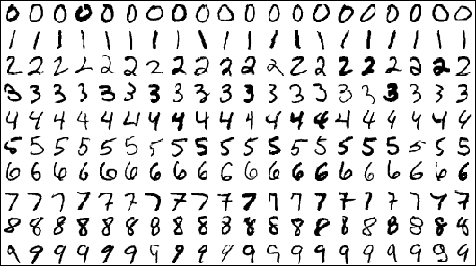

---
jupyter:
  jupytext:
    text_representation:
      extension: .Rmd
      format_name: rmarkdown
      format_version: '1.2'
      jupytext_version: 1.19.1
  kernelspec:
    display_name: Python 3 (ipykernel)
    language: python
    name: python3
---

```{r setup, include=FALSE}
library(reticulate)
use_python("/Users/Zhuanz/anaconda3/bin/python3.11", required = TRUE)
# or use your conda environment
use_condaenv("base", required = TRUE)
```

<!-- #region -->


Handwritten digital recognition is the first "big job" of data analysts' introductory computer vision.

The source of the handwritten digital picture data in the vast majority of competitions and related articles is MNIST database (Modified National Institute of Standards and Technology da Tabase), the reason why it is called modified is that the database is a subset of the super-large database NIST. After adjustment, the resolution of these digital pictures is the same, and the numbers are placed in the centre of the picture. There are 60,000 samples in the training set and 10,000 samples in the test set in the MNIST database. The complete data can be obtained from Professor Yann Lecun's MNIST homepage, and many attempts to identify algorithms can be seen from the homepage. Since its release in 1999, the picture data set has become a testing ground for many breakthrough classification algorithms, from 7.6% of linear classifiers to Convolutional neural network in 2016. (CNN, convolutional neural network) 0.21%, many masters in the field of machine learning work tirelessly to reduce the error rate of identification.

This case provides the dimension reduction and visualisation process of 1,083 handwritten digital pictures. The specific training of handwritten digital recognition models (from traditional kNN, SVM to deep learning models) can refer to the Digit Recognizer competition on kaggle.

### 0 Package version information
Check the version of the package by executing the shell command in the notebook.


```{python}
# !pip freeze | grep matplotlib;
# !pip freeze | grep scikit-learn;
# !pip freeze | grep numpy
```

### 1 Handwritten digital picture acquisition
In this case, we choose to import the handwritten digital picture data set directly from the `sklearn.datasets` module through `load_digits`, which is the Optical Recognition of Ha of UCI datasets. The test set in ndwritten Digits Data Set is only a very small subset of MNIST, with a total of 1797 handwritten digital pictures with a resolution of 8 × 8. At the same time, the picture has ten types of numbers from 0 to 9.

Let's import the `load_digits` module and the relevant packages required in this case first.

```{python}
from time import time # Used to calculate the running time
import matplotlib.pyplot as plt 
import numpy as np
from matplotlib import offsetbox # Define the format of the graphic box
from sklearn import (manifold, datasets, decomposition, ensemble,
                     discriminant_analysis, random_projection) 
# %matplotlib inline
# %config InlineBackend.figure_format = 'retina' # Adjust the clarity of the output picture in the notebook to make it clearer on the retina screen.
```

There is an `n_class` parameter in `load_digits`, which can specify how many types of pictures to be extracted (starting from the number 0), the default value is 10; there is also a `return_X_y` parameter (a new parameter of sklearn 0.18 version), if the parameter value is `True` , then return the picture data `data` and label `target`, and the default is `False`. If `return_X_y` is `False`, it will return a `Bunch` object, which is a dictionary-like object that includes data `data`, `images` and complete description information of the data set `DESCR`. Next, we will show these two reading methods separately:
- Return to the Bunch object


```{python}
digits = datasets.load_digits(n_class=6)
print (digits)
```

```{python}
# Get the data in the bunch, target
print (digits.data)
print (digits.target)
```

- Only return data and target

```{python}
data,target = datasets.load_digits(n_class=6, return_X_y=True)
print (data)
print (target)
```

In this case, only pictures from number 0 to number 5 are extracted for dimension reduction. We select the first six photos in the picture data set for display:

```{python}
# plt.gray() 
fig, axes = plt.subplots(nrows=1, ncols=6, figsize=(15, 15))
for i,ax in zip(range(6),axes.flatten()):
    ax.imshow(digits.images[i], cmap=plt.cm.gray_r)
plt.show()
```

In order to conveniently display handwritten digital pictures, we use the import method that returns to the Bunch object.

```{python}
digits = datasets.load_digits(n_class=6)
X = digits.data
y = digits.target
n_samples, n_features = X.shape
n_neighbors = 30
```

### Display some of the digital pictures

```{python}
n_img_per_row = 30 # Display 30 pictures per line

# The whole graphic accounts for 300*300. Since a picture is 8*8, a layer of white frame is wrapped around each picture to prevent the pictures from affecting each other.
img = np.zeros((10 * n_img_per_row, 10 * n_img_per_row))

for i in range(n_img_per_row):
    ix = 10 * i + 1
    for j in range(n_img_per_row):
        iy = 10 * j + 1
        img[ix:ix + 8, iy:iy + 8] = X[i * n_img_per_row + j].reshape((8, 8))  
plt.figure(figsize=(6,6))
plt.imshow(img, cmap=plt.cm.binary)
plt.xticks([])
plt.yticks([])
plt.title('A selection from the 64-dimensional digits dataset')
```

### 3 Dimminsiming and visualisation
Picture data is a kind of high-dimensional data (from tens to millions of dimensions). If each picture is regarded as a point in high-dimensional space, it is extremely difficult to display these points in high-dimensional space, so we need to downsimension these data and see the embedded structure of the whole data set in two-dimensional or three-dimensional space.

The process of calling the above methods for dimension reduction is similar:

- First, create an instance according to the specific method: instance name = sklearn module. Called method (setting of some parameters)

- Then convert the data: the converted data variable name = instance name.fit_transform(X), and in some methods such as LDA dimension reduction, the label y is also required.

- Finally, visualise the converted data: enter the converted data and the title, and draw a diagram of the two-dimensional space.

In order to facilitate drawing and unify the drawing style, we first define the plot_embedding function to draw low-dimensional embedded graphics.

Colour scheme:

- Green #5dbe80

- Blue #2d9ed8

- Purple #a290c4

- Orange #efab40

- Red #eb4e4f

- Grey #929591

```{python}
# First, define the function to draw the sample points in the two-dimensional space, and input the parameters: 1. Data after dimension reduction; 2. Title of the picture

def plot_embedding(X, title=None):
    x_min, x_max = np.min(X, 0), np.max(X, 0)
    X = (X - x_min) / (x_max - x_min) # 0-1 normalise each dimension. Note that there are only two dimensions of X at this time.
    
    plt.figure(figsize= (6,6)) # Set the size of the whole graphic
    ax = plt.subplot(111)
    colors = ['#5dbe80','#2d9ed8','#a290c4','#efab40','#eb4e4f','#929591']
    
    # Draw a sample point
    for i in range(X.shape[0]): # Each line represents a sample.
        plt.text(X[i, 0], X[i, 1], str(digits.target[i]),
                 #color=plt.cm.Set1(y[i] / 10.),
                 color=colors[y[i]],
                 fontdict={'weight': 'bold', 'size': 9})  # Draw a digital label of the sample point at the location of the sample point.
    
    # Draw thumbnails on the sample points and make sure that the thumbnails are sparse enough not to cover each other.
    # Only matplotlib version 1.0 or above, offsetbox has 'AnnotationBbox', so it is necessary to judge whether there is this function first.
    if hasattr(offsetbox, 'AnnotationBbox'): 
        shown_images = np.array([[1., 1.]])  # Assume that the thumbnail that appears at the beginning is at the (1,1) position.
        for i in range(digits.data.shape[0]):
            dist = np.sum((X[i] - shown_images) ** 2, 1) # Calculate the distance between the sample point and all the displayed pictures (shown_images)
            if np.min(dist) < 4e-3: # If the minimum distance is less than 4e-3, that is, there are two sample points very close to each other, then skip the thumbnail of the digital picture by continue.
                continue
            shown_images = np.r_[shown_images, [X[i]]] # The sample points showing the thumbnail are added to the shown_images matrix through longitudinal splicing.
            
            imagebox = offsetbox.AnnotationBbox(
                offsetbox.OffsetImage(digits.images[i], cmap=plt.cm.gray_r),
                X[i])
            ax.add_artist(imagebox)
            
    plt.xticks([]), plt.yticks([]) # The horizontal and vertical coordinate scale is not displayed.
    if title is not None: 
        plt.title(title) 
```

### 3.1 Random projection
Random projection is the simplest dimension reduction method. This method can only show the spatial structure of the entire data to a small extent, and most of the structural information will be lost, so this dimension reduction method is rarely used.


```{python}
t0 = time() 
rp = random_projection.SparseRandomProjection(n_components=2, random_state=66)
X_projected = rp.fit_transform(X)
plot_embedding(X_projected, 
               "Random Projection of the digits (time %.2fs)" %
               (time() - t0))
```

### 3.2 PCA
PCA dimension reduction is the most commonly used linear unsupervised dimension reduction method. PCA dimension reduction is actually a linear dimension reduction method of SVD decomposition of the covariance matrix for dimension reduction.

```{python}
t0 = time()
pca = decomposition.PCA(n_components=2)
X_pca = pca.fit_transform(X)
plot_embedding(X_pca,
               "Principal Components projection of the digits (time %.2fs)" %
               (time() - t0))
print (pca.explained_variance_ratio_) # What percentage of the variance of each component to the original data is explained?
```

### 3.3 truncated SVD
The truncated SVD method is to use the truncated SVD decomposition method to linearly reduce the dimension of data. Unlike PCA, this method will not centralise the data before SVD decomposition, which means that the method can effectively process sparse matrices such as scipy.sparse defined sparse matrices, while the PCA method does not support the input of scipy.sparse sparse matrix. In the field of text analysis, this method can perform SVD decomposition of sparse word frequency/tf-idf matrix, that is, LSA (implicit semantic analysis).

```{python}
t0 = time()
svd = decomposition.TruncatedSVD(n_components=2)
X_svd = svd.fit_transform(X)
plot_embedding(X_svd,
               "Principal Components projection of the digits (time %.2fs)" %
               (time() - t0))
print (svd.explained_variance_ratio_)
```

### 3.4 LDA
The LDA dimension reduction method uses the label information of the original data, so after dimension reduction, the sample points of the same class in the low-dimensional space are gathered together, and the points of different classes are separated and compared.

```{python}
X2 = X.copy()
X2.flat[::X.shape[1] + 1] += 0.01  
t0 = time()
lda = discriminant_analysis.LinearDiscriminantAnalysis(n_components=2)
X_lda = lda.fit_transform(X2, y)
plot_embedding(X_lda,
               "Linear Discriminant projection of the digits (time %.2fs)" %
               (time() - t0))
print (lda.explained_variance_ratio_)
```

### 3.5 MDS
If there is some kind of geographical location-like relationship between cities in terms of distance between the sample points, then MDS dimension reduction can be used to maintain this distance relationship in low-dimensional space.

```{python}
clf = manifold.MDS(n_components=2, n_init=1, max_iter=100)
t0 = time()
X_mds = clf.fit_transform(X)
plot_embedding(X_mds,
               "MDS embedding of the digits (time %.2fs)" %
               (time() - t0))
```

### 3.6 Isomap
Isomap is a kind of maniform learning method, which is an abronym for Isometric mapping. This method can be regarded as an extension of the MDS method. Unlike MDS, this method maintains the relationship of geodesic distances between all data points before and after dimension reduction.

Isomap needs to specify the number of nearest neighbours in the field, which we have already specified as 30 when extracting the picture data. Due to the need to calculate the geodesic distance of the sample point, the method consumes a lot of time.

```{python}
t0 = time()
iso = manifold.Isomap(n_neighbors=n_neighbors, n_components=2)
X_iso = iso.fit_transform(X)
plot_embedding(X_iso,
               "Isomap projection of the digits (time %.2fs)" %
               (time() - t0))
```

### 3.7 LLE
LLE dimension reduction also requires specifying the number of domain sample points n_neighbors. LLE dimension reduction maintains the distance relationship between sample points in the neighbourhood. It can be understood as a series of local PCA operations, but it maintains the unstructured information of the data well in the global field. LLE dimension reduction mainly includes four methods: standard, modified, hessian and ltsa. The following is shown one by one, and their reconstruction errors are output (the error when reconstructing data in the original space from low-dimensional space data).
#### standard LLE

```{python}
clf = manifold.LocallyLinearEmbedding(n_neighbors=n_neighbors, n_components=2, method='standard')
t0 = time() 
X_lle = clf.fit_transform(X)
plot_embedding(X_lle,
               "Locally Linear Embedding of the digits (time %.2fs)" %
               (time() - t0))
print("Reconstruction error: %g" % clf.reconstruction_error_)
```

#### modified LLE
There is a problem of regularisation in standard LLE: when n_neighbors is greater than the dimension of the input data, the local neighbourhood matrix will have a problem of rank-deficient. In order to solve this problem, a regularised parameter r is introduced on the basis of standard LLE. By setting the parameter method='modified', modified LLE dimension reduction can be realised.

```{python}
clf = manifold.LocallyLinearEmbedding(n_neighbors=n_neighbors, n_components=2, method='modified')
t0 = time()
X_mlle = clf.fit_transform(X)
plot_embedding(X_mlle,
               "Modified Locally Linear Embedding of the digits (time %.2fs)" %
               (time() - t0))
print("Reconstruction error: %g" % clf.reconstruction_error_)
```

#### hessian LLE
Hessian LLE, also known as Hessian Eigenmapping, is another way to solve the problem of LLE regularisation. The premise of this method is to satisfy `n_neighbors > n_components * (n_components + 3) / 2`.

```{python}
clf = manifold.LocallyLinearEmbedding(n_neighbors=n_neighbors, n_components=2, method='hessian')
t0 = time()
X_hlle = clf.fit_transform(X)
plot_embedding(X_hlle,
               "Hessian Locally Linear Embedding of the digits (time %.2fs)" %
               (time() - t0))
print("Reconstruction error: %g" % clf.reconstruction_error_)
```

#### LTSA
The LTSA (Local tangent space alignment) method is actually not a variant of LLE, but it is divided into LocallyLinearEmbedding because it is similar to the LLE algorithm. Unlike maintaining the distance relationship between adjacent points before and after LLE dimension reduction, LTSA portrays the geographical properties between the sample points in the neighbourhood by placing the data in the tangent space.

```{python}
clf = manifold.LocallyLinearEmbedding(n_neighbors=n_neighbors, n_components=2, method='ltsa')
t0 = time()
X_ltsa = clf.fit_transform(X)
plot_embedding(X_ltsa,
               "Local Tangent Space Alignment of the digits (time %.2fs)" %
               (time() - t0))
print("Reconstruction error: %g" % clf.reconstruction_error_)
```

It can be seen that the LLE reconstruction error of the standard method is the smallest.

### 3.8 t-SNE
This example uses the embedding generated by PCA to initialise t-SNE instead of the default setting of t-SNE (i.e. init='pca'). It ensures the global stability of embedding, that is, embedding does not depend on random initialisation.

The t-SNE method is very sensitive to the local structure information of data and has many advantages:

- Reveal the samples belonging to different maniforms or clusters

- Reduce the sample gathering in

Of course, it also has many shortcomings:

- The calculation cost is high, and it takes several hours on million-level picture data, while for the same task, PCA only takes a few minutes or seconds;

- The algorithm is random, and different random seeds will produce different dimension reduction results. Of course, it is feasible to select different random seeds and choose the random seed with the smallest reconstruction error as the parameter for the final implementation of dimension reduction;

- The global structure remains poor, but this problem can be alleviated by using the initial sample point of PCA (init='pca').

```{python}
tsne = manifold.TSNE(n_components=2, init='pca', random_state=10) # Generate tsne instance
t0 = time()  # The moment before the implementation of dimension reduction
X_tsne = tsne.fit_transform(X) # Downsimens to obtain data in two-dimensional space
plot_embedding(X_tsne, "t-SNE embedding of the digits (time %.2fs)" % (time() - t0)) # Draw the embedded graphics after dimension reduction
plt.show()
```

### 3.9 RandomTrees
`RandomTreesEmbedding` from the `sklearn.ensemble` module is not a multi-dimensional embedding method at the technical level, but it learns a high-dimensional representation of data that can be used in the data downsion reduction method. You can use `RandomTreesEmbedding` to represent the data in high dimensions first, and then use PCA or truncated SVD to reduce the dimension.

```{python}
hasher = ensemble.RandomTreesEmbedding(n_estimators=200, random_state=0, max_depth=5)
t0 = time()
X_transformed = hasher.fit_transform(X)
pca = decomposition.TruncatedSVD(n_components=2)
X_reduced = pca.fit_transform(X_transformed)
plot_embedding(X_reduced,
               "Random forest embedding of the digits (time %.2fs)" %
               (time() - t0))
```

### 3.10 Spectral embedding
Spectral embedding, also known as Laplacian Eigenmaps. It uses the spectral decomposition of Laplace diagrams to find the representation of data in low-dimensional space.

```{python}
embedder = manifold.SpectralEmbedding(n_components=2, random_state=0, eigen_solver="arpack")
t0 = time()
X_se = embedder.fit_transform(X)
plot_embedding(X_se,
               "Spectral embedding of the digits (time %.2fs)" %
               (time() - t0))
```

### 4 Summary
This case uses a variety of dimension reduction methods for dimensional reduction and visualisation of handwritten digital picture data, including PCA, LDA and dimension reduction methods based on maroid learning.

Linear dimension reduction methods include PCA and LDA, which consume less time, but this linear dimension reduction method will lose nonlinear structure information in high-dimensional space. In comparison, the manifold learning method in the nonlinear dimension reduction method (KPCA and KLDA are not mentioned here. If you are interested, you can try these two types of nonlinear dimension reduction methods) can well preserve the nonlinear structure information in high-dimensional space. Although the typical mariform learning is a non-supervised method, there are also some variants of the supervised method.

When downsizing data, we must figure out whether the purpose of our dimension reduction is to extract features to make the subsequent model more interpretable or improve the effect, or just to visualise high-dimensional data. In the choice of dimension reduction method, we should also try to balance the time cost and the dimension reduction effect.

In addition, the following points should be noted when downsiming:

- Before dimension reduction, the scale of all features is consistent;

- The reconstruction error can be used to find the optimal output dimension d (at this time, the dimension reduction is not only for visualisation). As the dimension d increases, the reconstruction error will decrease until the threshold value set is reached;

- The noise point may cause a "short circuit" of the maniform, that is, the two parts that were originally easily separated in the maniform are connected together by the noise point as a "bridge";

- Some types of input data may cause the weight matrix to be singular, such as more than two sample points in the data set that are the same, or the sample points are divided into non-intersecting groups. In this case, the implementation of eigenvalue decomposition solver='arpack' will not find zero space. The easiest way to solve this problem is to use solver='dense' to achieve eigenvalue decomposition. Although dense may be slower, it can be used on singular matrices. In addition, we can also think of a solution by understanding the singular cause: if it is caused by non-intersecting sets, we can try to increase n_neighbors; if it is due to the existence of the same sample points in the data set, we can try to remove these duplicate sample points and only keep One of them.
