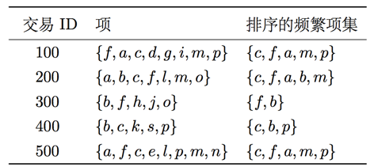
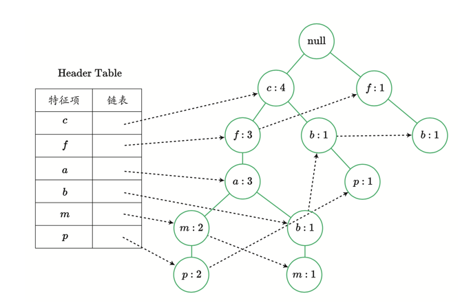

---
jupyter:
  jupytext:
    text_representation:
      extension: .Rmd
      format_name: rmarkdown
      format_version: '1.2'
      jupytext_version: 1.19.1
  kernelspec:
    display_name: Python 3 (ipykernel)
    language: python
    name: python3
---

```{r setup, include=FALSE}
library(reticulate)
use_python("/Users/Zhuanz/anaconda3/bin/python3.11", required = TRUE)
# or use your conda environment
use_condaenv("base", required = TRUE)
```

<!-- #region -->

#### Version package information

```{python}
# !pip freeze | grep sklearn;
# !pip freeze | grep pandas;
# !pip freeze | grep numpy
```

### Algorithm realisation
#### Brief description of FP-Growth
The frequent pattern algorithm consists of three main parts:

- Construct a frequent pattern tree (FPTree)

- Obtain the Conditional Pattern Base from the FP tree

- For each frequent item, construct a Conditional FPTree according to the conditional pattern base, and recursively dig the conditional FP tree until the tree is empty.

#### Data structure of FP-Growth
We construct two data structures needed in algorithm implementation, Node and FPTree.

- Node

The Node class represents the nodes in the tree, saving information such as the children of the node, the parent node, and the number of frequencies (count) of the elements (value) represented by the node.

- FPTree

FPTree represents an FP tree, which stores the data set in a tree structure. The root node is null, and the remaining nodes represent a frequent term in the data set and its support information. Because different frequent items will overlap, the data stored in the FP tree structure can share the same path to achieve the effect of compressing data.

```{python}
class Node:
    
    def __init__(self, name, count, parent):
        self.name = name
        self.count = count
        self.link = None
        self.parent = parent
        self.children = {}
    
    def increment(self, num):
        self.count += num
    
    def display(self, lens = 1):
        print ('   '*lens, self.name, ' ', self.count)
        for child in self.children.values():
            child.display(lens + 1)
```

Then, we realise the FPTRee class, which is also the core data structure of the frequent tree growth algorithm.

```{python}

class FPTree:
       
    def __init__(self, transactions, min_support, root_value, count, flag):
        
        self.flag = flag
        self.root = Node(root_value, count, None)   
        self.data = transactions
        self.data_type = type(self.data) 
        self.min_support = min_support      
       
        self.frequent = self.find_frequent_items()
            
        self.headerTable = {v:[self.frequent[v], None] for v in self.frequent}
    
    def find_frequent_items(self):
    
        from collections import defaultdict
        freq1 = defaultdict(int)

        if self.data_type == list and self.flag == 'fptree':
            
            flatten_list = [element for item in self.data for element in item]
            for value in flatten_list:
                freq1[frozenset([value])] += 1

        elif self.data_type == dict and self.flag == 'cfptree':
            for item in self.data:
                for element in item:
                    
                    if type(element) == frozenset:
                        freq1[element] += self.data[item]
                    else:
                        freq1[frozenset([element])] += self.data[item]
    

        return {v:freq1[v] for v in freq1 if freq1[v] >= self.min_support}
    
    def build_tree(self):
    
        root = Node('null', 1, None)
        sorted_headertable = [v[0] for v in sorted(self.frequent.items(), key=lambda kv: (-kv[1], list(kv[0])[0]))]

        for record in self.data:
            
            sorted_items = [item for item in sorted_headertable if list(item)[0] in record]

            node = self.root        
            while len(sorted_items) > 0:
            
                first_value = sorted_items[0]
                
                if  first_value in node.children:
                    if self.data_type == list:             
                        node.children[first_value].increment(1)
                    elif self.data_type == dict:
                        node.children[first_value].increment(self.data[record])
    
                else:

                    if self.data_type == list:             
                        node.children[first_value] = Node(list(first_value)[0], 1, node)
                    elif self.data_type == dict:
                        node.children[first_value] = Node(first_value, self.data[record], node)
            
                    if self.headerTable[first_value][1] == None:
 
                        self.headerTable[first_value][1] = node.children[first_value]
                        
                    else:
                        currentNode = self.headerTable[first_value][1]
               
                        while currentNode.link != None:
                            
                            currentNode = currentNode.link
                        currentNode.link = node.children[first_value]
                sorted_items.pop(0)
                node = node.children[first_value]

    def get_tree(self):
        return self.root
    def get_frequent_items(self):
        return self.frequent
    def get_headertable(self):
        return self.headerTable
    def get_data(self):
        return self.data
    
    def show(self, depth = 1):
        print (' '*depth, self.root.name, ' ', self.root.count)
        for node in self.root.children.values():
            node.display(depth + 1)
```

### Build an FP tree
We use a toy data set to test the tree-building process of the algorithm. The contents of the data set are as follows:


```{python}
# Data set stored in the two-dimensional list
data = [
    ['f', 'a', 'c', 'd', 'g', 'i', 'm', 'p'],
    ['a','b','c','f','l','m','o'],
    ['b','f','h','j','o'],
    ['b','c','k','s','p'],
    ['a','f','c','e','l','p','m','n']]
data
```

The frequent tree corresponding to the data set is:

In the test example, we set the minimum support to 3, and then use data to create an instance object fptree of the FP tree.


```{python}
#Minimum support
min_support = 3

#Create an instance
fptree = FPTree(data, min_support, 'null', 1, 'fptree')
```

By calling the `get_frequent_items()` method, we can view the frequent 1 item set of the data set. Judging from the results, the items `d, e, g, i, k, l, h, n, o, s` that do not meet the minimum support conditions are filtered out.

```{python}
# Frequent 1-item set collection
freq1 = fptree.get_frequent_items()
freq1
```

Then, in the process of building a tree, we can examine the establishment process of the FP tree in detail through the print statement of the build_tree() method.

```{python}
fptree.build_tree()
```

```{python}
fptree.show(1)
```

### Excavate the FP tree
The frequent tree growth algorithm divides the constructed FP tree into a series of conditional model libraries. Then, based on each conditional pattern library, the conditional frequent pattern tree is recursively constructed. For example, we construct a conditional pattern library with p as the suffix. First, we trace back all paths (cbp, cfamp) according to the linked list structure of p stored in the frequent item table; then, we continue to construct the FP tree by removing p from the path as a new item set.

In the constructed FP tree species, we use the function `find_prefix()` to trace back the path with a node as the suffix.

```{python}
def find_prefix(node):
  
    #Conditional mode library
    cpb = {}
    suffix_list = []

    # Judge whether the tail of the linked list has been reached.
    while node != None:
        suffix_list.append(node)
        node = node.link
   
    for item in suffix_list:

        path = []
        num = item.count
        # Judge the conditions, whether it has been traced back to the top of the tree
        while item.parent != None:
            path.append(item.name)
            item = item.parent
      
        # Remove the part of the current node as the conditional mode base, and take the support of the current node as the support of the conditional mode library.
        cpb[frozenset(path[1:])] = num
        
    return cpb    
```

Next, we construct the `mine_tree` method to realise the mining process of the FP tree.

```{python}
def mine_tree(frequent_items, headerTable, min_support, frequent, item_list):
    
    # The elements in the frequent term table are arranged in descending order
    candidates = [v[0] for v in sorted(frequent_items.items(), key=lambda kv: (-kv[1], list(kv[0])[0]))]
    #print candidates
    for item in candidates[::-1]:
        
        #Start with the following elements
        #print 'from the node: ', item
        # Generate frequent item sets for each conditional pattern library
        freq_set = frequent.copy() 
        freq_set.add(item)
        item_list.append(freq_set)
        
        # Generate a conditional pattern library
        cpbs = find_prefix(headerTable[item][1])
       
        #print 'its cpbs: ', cpbs
        #Create a conditional FP tree
        cTree = FPTree(cpbs, min_support, 'root', 1, 'cfptree')
        
        cTree.build_tree()
       
        #print '-----headerTable: ', cTree.get_headertable()
        #Judgement condition: the frequent item table is empty
        if len(cTree.get_headertable()) != 0:
            #print 'condtional tree for: ', freq_set
            #cTree.show(1)    
            mine_tree(cTree.get_frequent_items(), cTree.get_headertable(), min_support, freq_set, item_list)
```

Substitute the constructed FP tree instance `fptree` into the function `mine_tree` and return all the frequent item sets.

```{python}
#Store all frequent items
frequent_item = []
#Store the frequent items generated by an iteration process
frequent = set()

#Root node of FP tree
root_node = fptree.get_tree()
#Headertabl of data set datae
headertable = fptree.get_headertable()
#The frequent 1-item set of data set data
freq_items = fptree.get_frequent_items()

#Excavate FP tree fptree
mine_tree(freq_items, headertable, min_support, frequent, frequent_item)
```

Print the content of `frequent_item` and display all frequent sets.

```{python}
frequent_item
```

### Rule mining based on questionnaire survey data set
#### Data preprocessing

```{python}
# Third-party libraries that need to be used in the process of import processing
from sklearn.preprocessing import Binarizer
import pandas as pd
import numpy as np
```

Use the `read_csv()` function of the `Pandas` library to read the data.

```{python}
real_data = pd.read_csv('dataset/responses.csv')
real_data.head()
```

```{python}
# The size of the data set
real_data.shape
```

First of all, we need to know whether there are missing values in the data set. Here, we use the isnull() function to obtain the boolean matrix, and sum them along the rows and columns respectively to observe the missing data. In Python, if the element is True, it is written as 1; if the element is True, it is written as 1; if it is noted, it is written as 0.

```{python}
# Give an example
boo_list = [True, True, False, True]
sum(boo_list)
```

Use such characteristics to obtain the missing value distribution information of the data set.

```{python}
# Missing value of data record (line)
row_missing = real_data.isnull().sum(axis = 1)

# non_missing_indicator
non_missing_indicator = row_missing == 0
missing_indicator = np.logical_not(non_missing_indicator)

non_missing_index = list(row_missing[non_missing_indicator].index)
```

```{python}
print ('number of non missing record: ', len(non_missing_index))
```

View the index of rows containing missing values.

```{python}
missing_index = list(row_missing[missing_indicator].index)
print (missing_index)
```

```{python}
print ('missing ratio: ', format(float(len(missing_index))/real_data.shape[0], '0.1%'))
```

```{python}
# From the perspective of the column
col_missing = real_data.isnull().sum()

non_missing_attribute = list(col_missing[col_missing == 0].index)
missing_attribute = list(col_missing[col_missing != 0].index)
print (non_missing_attribute)
```

```{python}
print ('attribute missing ratio: ', format(float(real_data.shape[1] - len(non_missing_attribute))/real_data.shape[1], '0.1%'))
```

After mastering the missing data, it is necessary to examine the type of data set variables and the corresponding missing value processing method.

```{python}
# Check the types of each variable in data
real_data.dtypes.value_counts()
```

```{python}
attribute_type = dict(real_data.dtypes)
attribute_type
```

In this case, we delete rows that contain missing values and keep all variables.

```{python}
new_data = real_data.dropna(axis = 0)
new_data.shape
```

In order to use the frequent pattern algorithm to find potentially associated variables, we need to process the value of the variable, including discrete and binary, which is convenient for subsequent statistics. Next, we adopt different processing methods for different types of variables.

For floating-point variables, we need to understand the value range of each variable. Here, we count the maximum value of each variable.

```{python}
float_attribute = [v for v in attribute_type if attribute_type[v] == 'float64']
float_data = new_data[float_attribute].max()

float_data.value_counts()
```

```{python}
float_data[float_data != 5.0]
```

For general floating-point variables (the maximum value is 5.0), we can directly binarise it, and the threshold is 3.

```{python}
#130 ordinary floating-point variables

personal_attribute = ['Height', 'Age', 'Weight', 'Number of siblings']

float_attribute = [v for v in attribute_type if attribute_type[v] == 'float64' and v not in personal_attribute]
print (float_attribute)
```

```{python}
# Method 1
binary_float_attr = new_data[float_attribute].applymap(lambda x: 1 if x > 3.0 else 0)
binary_float_attr.head()
```

```{python}
# Method 2
bianry_float_attr1 = Binarizer(threshold=3).transform(new_data[float_attribute])
bianry_float_attr1
```

For floating-point variables stored in `personal_attribute`, it is necessary to carry out variable discretisation first, and then feature coding.

```{python}
new_data[['Age','Height', 'Weight', 'Number of siblings']].describe()
```

```{python}
# Age variable

#Threshold
level = 20

binary_age_attr = new_data[['Age']].applymap(lambda x: 1 if x >=20 else 0)
binary_age_attr.columns = ['Age_older_than_20']
binary_age_attr.head()
```

```{python}
# Height variable
#Delimit three sub-intervals
binary_height_attr = pd.get_dummies(pd.qcut(new_data['Height'], 3), prefix='Height_')
binary_height_attr.head()
```

```{python}
#Weight variable
#Delimit four sub-intervals
binary_weight_attr = pd.get_dummies(pd.qcut(new_data['Weight'], 4), prefix='Weight_')
binary_weight_attr.head()
```

```{python}
#Number of Siblings variable
#Delimit 2 sub-intervals
binary_sibling_attr = new_data[['Number of siblings']].applymap(lambda x: 1 if x > 3.0 else 0)
binary_sibling_attr.columns = ['Number of siblings_larger_than_3']
binary_sibling_attr.head()
```

```{python}
# Character-type variables
str_attribute = [v for v in attribute_type if attribute_type[v] == 'object']
print (str_attribute)
```

We can check the value of the character variable, and then use the `get_dummies()` function of the `Pandas` library for feature encoding.

```{python}
# Check the values of each character type variable
value_list = []
for item in str_attribute:
    index = list(new_data[item].value_counts(dropna=False).index)
    value_list.append(index)
    print (index)
    print ('')
```

```{python}
# Characteristic coding
binary_str_attr = pd.get_dummies(new_data[str_attribute])
binary_str_attr.head()
```

```{python}
# Integerity variable

int_attribute = [v for v in attribute_type if attribute_type[v] == 'int64']
print (int_attribute)
```

For integer variables, we choose the threshold value of 3 for binaryisation.

```{python}
binary_int_attr = new_data[int_attribute].applymap(lambda x: 1 if x > 3 else 0)
binary_int_attr.columns = ['Eating to survive_very_much', 
                           'Snakes_very_much',
                          'Number of friends_larger_than_3',
                          'Dreams_very_much',
                          'Spending on gadgets_very_much']
binary_int_attr.head()
```

Use the `concat` function to put the processed variables together.

```{python}
final_data = pd.concat([binary_float_attr.reset_index(drop=True), 
                        binary_str_attr.reset_index(drop=True), 
                        binary_int_attr.reset_index(drop=True),
                        binary_age_attr.reset_index(drop=True),
                        binary_height_attr.reset_index(drop=True),
                        binary_weight_attr.reset_index(drop=True),
                        binary_sibling_attr.reset_index(drop=True)], axis=1) 
final_data.head()
```

```{python}
final_data.shape
```

After preprocessing such as discrete and binary, the original `real_data` generates new data final_data. The number of variables is increased from 150 to 177, and the values are all 0 or 1.

In order to facilitate the input algorithm, we convert `final_data` into a nested list format in the form of a sample data set.

```{python}
input_data= []

#Variable name
column_name = final_data.columns.values

# The number of rows of the data set
row = final_data.shape[0]

# Record for each line of data
for index in range(row):
    name_list = []
    # Add the variable name with the corresponding position value of 1 to the name_list
    for item in column_name:
        if final_data.loc[index, item] == 1:
            name_list.append(item)
        else:
            continue
    # Put the name_list generated by each line of data record conversion into the final result list.
    input_data.append(name_list)
```

```{python}
# Display the first 2 lines of data
print (input_data[:2])
```

```{python}
# Minimum support
min_support = 400

fptree = FPTree(input_data, min_support, 'null', 1, 'fptree')
```

```{python}
# 1 set of frequent events
frequent1 = fptree.get_frequent_items()

print (u'The number of frequent set sets is：', len(frequent1))
print ('')
print (frequent1)
```

Due to the large number of variables in the data set, we temporarily annotate the print statements in `build_tree()` and `mine_tree()` to facilitate program operation and result display.

```{python}
fptree.build_tree()
```

After the construction of the tree, we began to dig FPtree. Starting from the frequent mode with length 1, the conditional mode library is generated. Then use the conditional pattern library as the data set, construct the conditional FPtree, and generate the frequent pattern set.

```{python}
frequent_item = []
frequent = set()

root_node = fptree.get_tree()
headertable = fptree.get_headertable()
freq_items = fptree.get_frequent_items()
mine_tree(freq_items, headertable, min_support, frequent, frequent_item)
```

Print and output the content of `frequent_item`.

```{python}
frequent_item 
```

From the frequent focus, we can understand the living conditions of teenagers. For example, having a good time with friends, liking music, comedy, movies and other qualities of these teenagers often appear together. Of course, there are many other interesting information that can be found in the frequent item centre.

