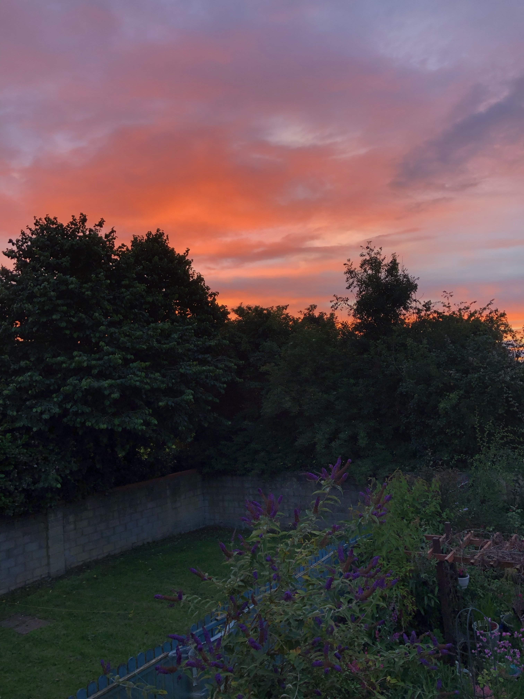
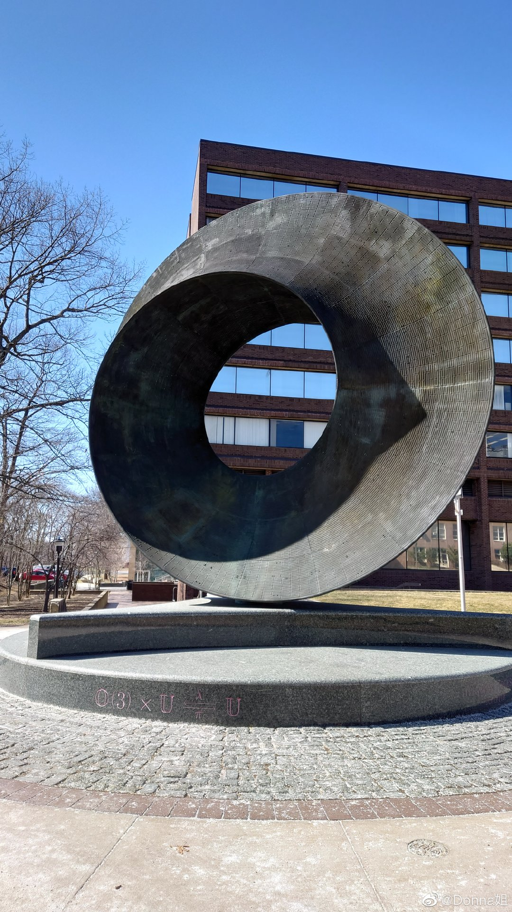

```{r setup, include=FALSE}
knitr::opts_chunk$set(echo = FALSE)

# Learn more about creating websites with Distill at:
# https://rstudio.github.io/distill/website.html

```

{width=50%}

<center>
:::: {style="display: flex;"}

::: {}

{width=90%}

{width=90%}

:::

::: {}

{width=70%}

{width=70%}

:::

::::


</center>

## Education

MSc in Data Science and Analytics, 2024
National University of Ireland, Maynooth


BEng in Naval Architecture and Ocean Engineering, 2012
Naval University of Engineering

## Work Experience


## Contact

The easiest way to contact me, is to add my WeChat ['@Xiang'](images/xiang.png)! If you are interested in collaboration, feel free to [email me](longxiangwu@outlook.com).

